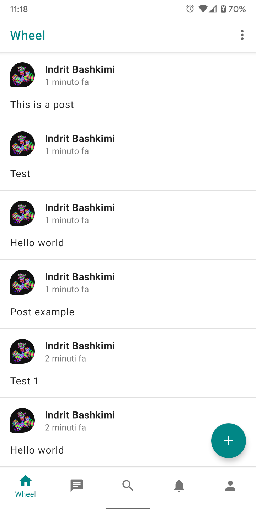
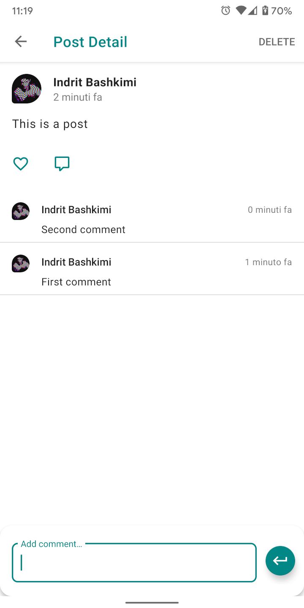
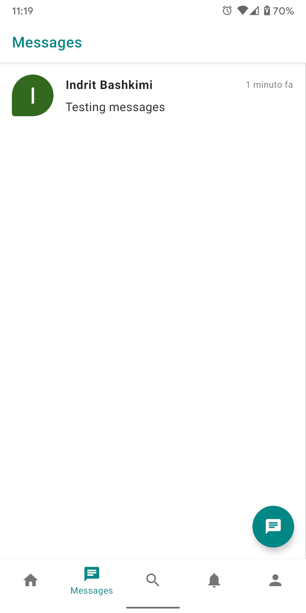
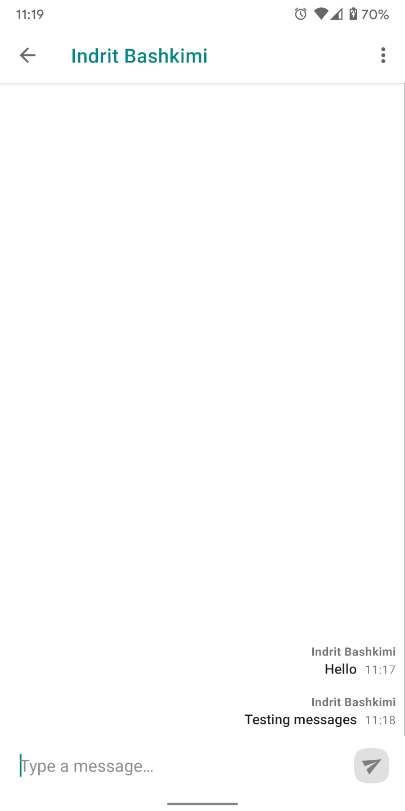

# Wheel

Wheel is a sample android app demonstrating how a social network can be built using [Firebase Firestore](https://firebase.google.com/docs/firestore).

This app is **work in progress**. Features implemented so far:
- [x] Login
- [x] Share posts
- [x] Comment posts
- [x] Follow users
- [x] Chat with other users
- [ ] Add security rules
- [ ] Like posts/comments
- [ ] Edit profile info
- [ ] Chat rooms
- [ ] Edit chat name, image etc.
- [ ] ...

To try out this app, you need to: 
* [Add Firebase to the project](https://firebase.google.com/docs/android/setup). 
* [Get a Google Map API key](https://developers.google.com/maps/documentation/android-sdk/start#step_4_get_a_google_maps_api_key).
 
## Screenshots
|||||

## License
Wheel is licensed under [The MIT License (MIT)](LICENSE).